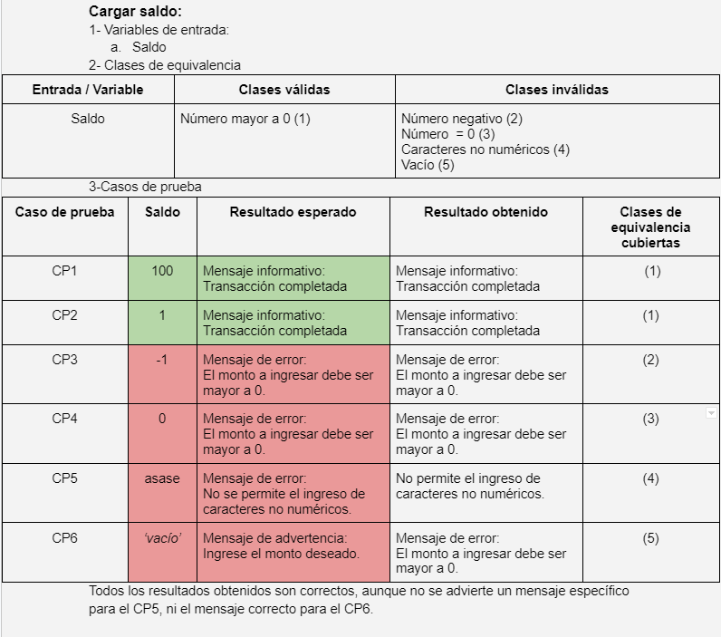
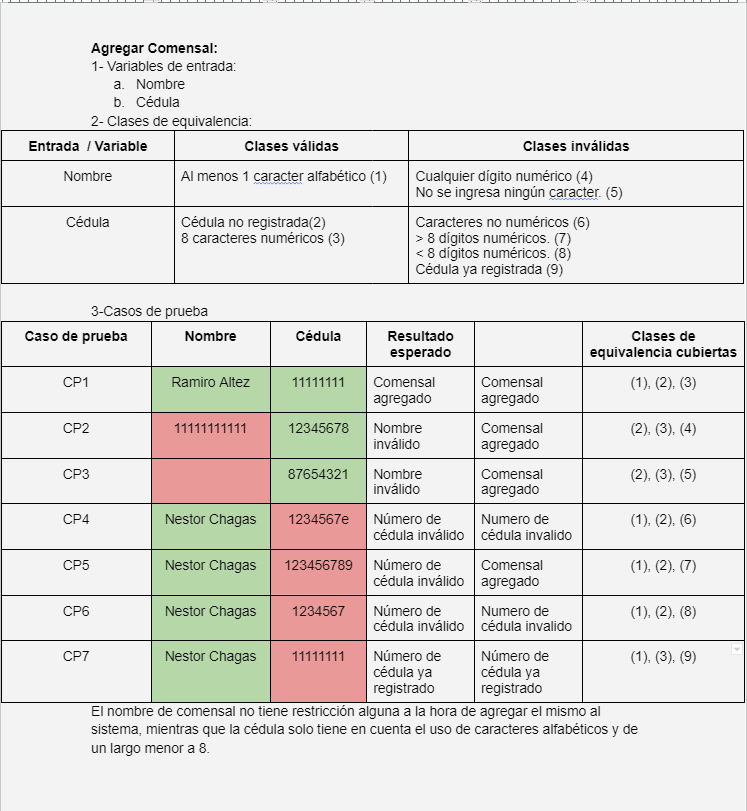
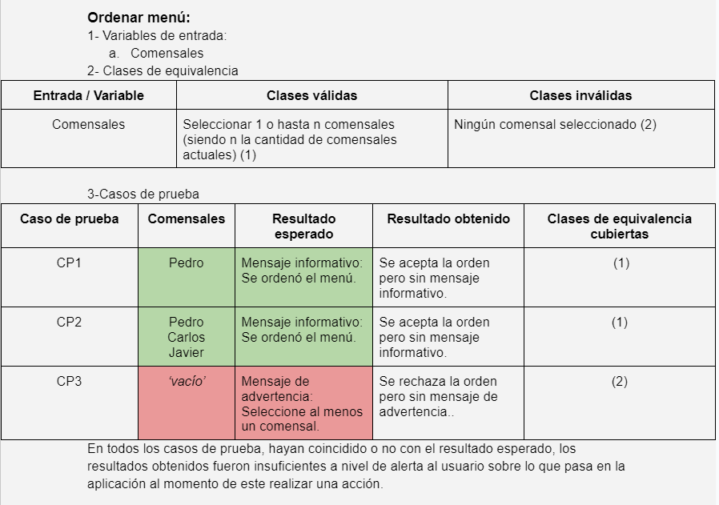
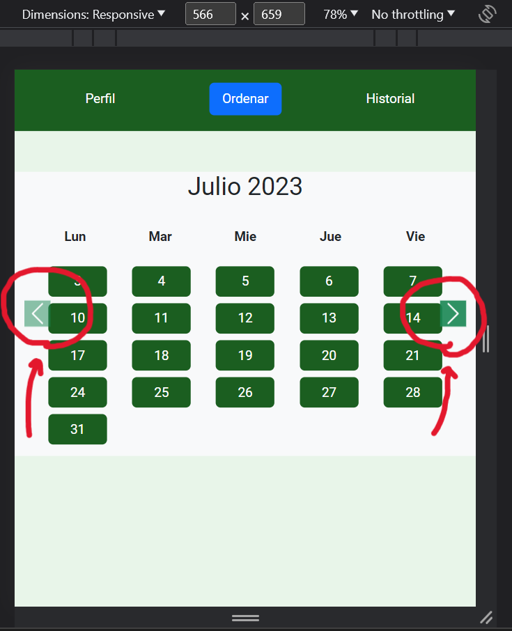
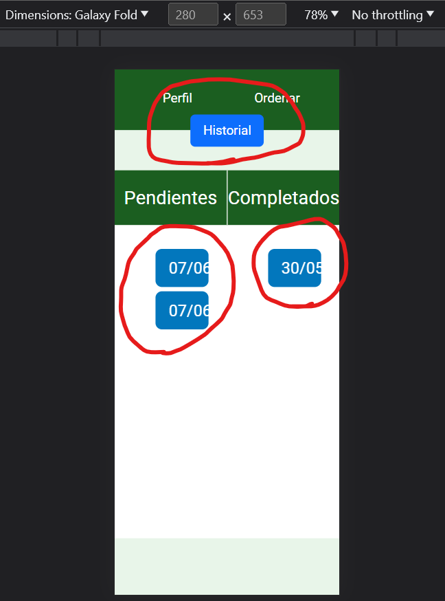
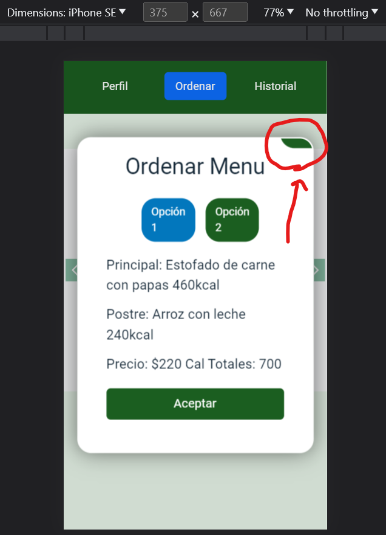

Universidad ORT Uruguay Facultad de Ingeniería       
Obligatorio 2 Fundamentos de Ingeniería de Software      
Nicolás de la Hoz (286894), Ignacio Sena (286403) y Renato Ríos (270586) 

# Informe de testing 
Proyecto asignado: [https://github.com/ORT-FIS-2023S1/proyecto-elosegui-macedo-pucciarelli]

## Test del sistema

### Casos de prueba - Partición equivalente:

Aclaración: las imágenes se encuentran en la carpeta testingImgs.png

### Sesiones de pruebas exploratorias:

Tester: Nicolás de la Hoz             
Misión: Prueba general de la aplicación.            
Tiempo: 30 minutos          
Fecha: 23/06/2023        
Ambiente: navegador Chrome, desde 280px de ancho hasta 1268px.            
Notas:           
- En anchos de pantalla entre 500px y 575px se superponen los botones de cambiar de mes en la ventana 'Ordenar'.

- En pantallas de 280px de ancho como en las del 'Galaxy Fold' la aplicación deja de ser responsive: el elemento Historial se "sale" del nav, y el texto de los botones 'Cargar saldo' y 'Agregar comensal' se salen del botón en la ventana 'Perfil', al igual que el texto de los botones de los pendientes y completados de la ventana 'Historial'.

- En la ventana 'Ordenar', al darle click a un día y entrar en la ventana 'Ordenar Menu', la acción "scroll hacia abajo" hace que la cruz para cerrar la ventana no se vea. Esto se repite para todas las ventanas emergentes con esta característica.

- En la ventana 'Ordenar', al darle click a un día y entrar en la ventana 'Ordenar menu', la palabra menú va con tilde.
- En la ventana 'Perfil', al darle click al botón 'Cargar Saldo' y realizar dicha acción, tanto la palabra transacción como éxito van con tilde.
- En la ventana 'Perfil', al darle click al botón 'Agregar Comensal' y realizar dicha acción, tanto la palabra asignación como agregó van con tilde.
- El sitio no es 100% navegable con teclado.
- En la ventana 'Ordenar', no es posible ver el menú de cada día, para esto hay que acceder a cada día.
- En la ventana 'Ordenar', al seleccionar un día, en la ventana 'Ordenar Menu' no es posible ver los platos del día, para esto hay que clickear en cada opción, y las mismas no tienen el nombre del plato.
- A la hora de pagar una orden, no hay un mensaje para confirmar el pago, siendo esto un paso sensible. Ademas de que se debe pagar las ordenes una por una.

Tester: Renato Ríos           
Misión:          
Validar que la apariencia de la aplicación sea similar en distintos navegadores.         
Validar que la gramática y ortografía sean correctas en todo el sitio.           
Validar consistencia en los distintos mensajes que emite la aplicación            

Tiempo: 90 minutos      
Fecha: 23/06/2023         
Ambiente: Chrome, Firefox, Opera        
Notas:           
- Hay faltas ortográficas. Entras a la aplicación, en la página de Perfil, al cargar un saldo o un comensal, sale una ventana modal, si se le da aceptar, aparece un mensaje de éxito, hay faltas ortográficas (faltan tildes).

- En la página Perfil, al agregar un comensal se pide el nombre y número de cédula, pero se puede agregar un comensal sin asignarle un nombre.

- En la página de Historial, en el caso de que haya un pedido pendiente o completado, si se cliquea en una de las dos opciones aparece una ventana modal, en dicha ventana se muestra información —comensal, fecha, consumo, principal, postre, precio y cal totales. La línea donde se indica el Precio tiene también Cal Totales, lo que resulta confuso al momento de visualizar dicha información. Este ‘error’ visual aparece tanto si se abre un elemento de la lista de pendientes o de completados.

- La aplicación se visualiza de forma similar en los navegadores en los cuales sé probó.

- En la página de Perfil, al hacer clic en "Cargar saldo" sale una ventana modal, si ingreso un monto mayor a 0 y le doy aceptar no me pide confirmación. Sería bueno que hubiera una confirmación antes de realizar la acción.

- En la página de Ordenar se visualizan dos meses (junio y julio), cada día de la semana tiene una comida diferente, pero para el mismo día hay la misma comida; por ejemplo, todos los lunes tienen milanesa de pollo, todos los martes bife con papas. ¿Por lo tanto, no sería mejor mostrar el menú para la semana, en lugar de hacerlo para dos meses? El motivo es que se facilita la visualización de la información y se removerá elementos de la pantalla, dando un estilo más limpio y claro.

- En la página de Ordenar, al hacer clic sobre un día de los que aparece en el calendario, se despliega una ventana modal. En dicha ventana aparece la lista de alumnos de los cuales se es responsable, si selecciono uno y a continuación hago clic en Aceptar, se cobra el importe establecido sin una confirmación previa.

- En la página de Ordenar, al hacer clic sobre un día de los que aparece en el calendario, se despliega una ventana modal. En dicha ventana se pueden observar errores ortográficos, falta tilde en las palabras ‘menu’ y ‘opcion’.
Los mensajes que emite la aplicación son consistentes.

- En la página Ordenar, al hacer clic sobre uno de los días disponibles, aparece una ventana modal, si le doy clic a Aceptar se confirma el pedido y que la lista de Pendientes en la página Historial, pero no se descuenta el monto del pedido del total que tengo en la cartera. Corrección, si se descuenta, pero en necesario pagar en la página Historial, lo cual es poco intuitivo. Por dicha razón en un inicio se reportó como un error.

- Tras experimentar redimensionar la aplicación, se detectaron algunos problemas en anchos de pantallas que sean menores a 500 píxeles. Estos errores se encuentran en las páginas de Ordenar e Historial. Por ejemplo, en Historial, la fecha en la cual fue completado el pedido no se ve correctamente. Y en Ordenar los botones que permiten navegar entre los meses quedan solapados o pegados a los botones del día del calendario.

Tester: Ignacio Sena         
Misión:    
Validar que la gramática y ortografía sean correctas en todo el sitio.    
Validar consistencia en los distintos mensajes que emite la aplicación.   

Tiempo: 30 minutos.   
Fecha: 23/6/2023   
Ambiente: Microsoft Edge   
Notas:   
- Los menús de la ventana "Ordenar" se repiten para todos los días coincidentes (ej: todos los lunes)

- Tanto en la ventana "Ordenar", al seleccionar un día del calendario como en la ventana "Historial" al seleccionar una orden, hay un error en la suma de las Kcal. Al mostrar el total se muestran como cal, lo que puede llevar a confusiones.

- En la carga del saldo en la ventana "Perfil", no hay un límite para la misma. Añadido, hay errores ortográficos (faltan tildes) en el aviso al cargar el mismo. 

- Al agregar comensales, hay una serie de diversos errores con el ingreso de datos:
el casillero nombre puede estar en blanco, el nombre acepta caracteres numéricos, la cédula puede tener más de 8 dígitos.
Pasos: 1) Acceder a la ventana “Perfil” en la barra de navegación
       2) Ir a la opción “Agregar comensal”

- Al comprar una comida, cuando aparece la ventana para elegir los comensales, no se suman los precios en caso de elegir más de uno. Además hay errores ortográficos (falta de tildes). Tampoco hay un mensaje de confirmación, por lo que no queda claro si el pedido fue aceptado. Tampoco hay una actualización en el saldo según los pedidos actuales. Se aceptan una infinidad de pedidos para los mismos comensales en el mismo día.
Pasos: 1) Acceder a la ventana “Menú” en la barra de navegación
       2) Elegir un día en el calendario
       3) Elegir la opción de comida y presionar “aceptar”
       4) Marcar más de un comensal y dar “aceptar”
Imagenes:
.png)
.png)
.png)

- En la ventana de pedidos pendientes, el botón “cancelar” puede confundir con cancelar la acción actual, cuando en verdad cancela la orden. No hay un mensaje de confirmación al pagar un pedido ni tampoco al cancelarlo. No se ve por ninguna parte el saldo actual a la hora de pagar.
Pasos: 1) Acceder a la ventana “Historial” en la barra de navegación
       2) Elegir un pedido pendiente
       3) Elegir la opción “pagar”
Imagenes:

- Hay un gran problema con la visualización de la información: en el menú a la hora de querer ordenar y no tener saldo disponible, te sale un aviso de que el saldo es insuficiente. Ahora bien, en caso de querer ordenar varias cosas, tendrías que hacer la suma del total por fuera de la aplicación para poder saber cuanto dinero tendrías que cargar. Donde se tendría que avisar la falta de dinero en la cartera es en la zona de confirmar pedidos, dónde podemos encontrar otro error: nunca se dice el precio total de los pedidos cargados hasta el momento. Además, al manejar los pedidos de uno en uno, la confirmación del pago se hace extremadamente tediosa. También considero que la información preliminar de los pedidos en la ventana “Historial” es insuficiente, sería mejor saber para quién son los pedidos sin tener que acceder al pedido en cuestión y el precio unitario.
Imagenes:

- La ventana “Historial” no debería contener las órdenes pendientes, ya que no es esperable que ahí se encuentren. Debería haber una cuarta ventana donde se manejen las mismas.

## Reporte de issues

Resumen de los issues reportados en GitHub: 

Diseño:     
Severidad baja:     
-  En pantallas de 280px de ancho como en las del 'Galaxy Fold' la aplicación deja de ser responsive: el elemento Historial se "sale" del nav, y el texto de los botones 'Cargar saldo' y 'Agregar comensal' se salen del botón en la ventana 'Perfil', al igual que el texto de los botones de los pendientes y completados de la ventana 'Historial'.
- En la ventana 'Ordenar', al darle click a un día y entrar en la ventana 'Ordenar Menu', la acción "scroll hacia abajo" hace que la cruz para cerrar la ventana no se vea. Esto se repite para todas las ventanas emergentes con esta característica.
- Tanto en la ventana "Ordenar", al seleccionar un día del calendario como en la ventana "Historial" al seleccionar una orden, hay un error en la suma de las Kcal. Al mostrar el total se muestran como cal, lo que puede llevar a confusiones.

Severidad media:     
- En anchos de pantalla entre 500px y 575px se superponen los botones de cambiar de mes en la ventana 'Ordenar'.
- El sitio no es 100% navegable con teclado.
- En la ventana 'Ordenar', no es posible ver el menú de cada día, para esto hay que acceder a cada día.
- En la ventana 'Ordenar', al seleccionar un día, en la ventana 'Ordenar Menu' no es posible ver los platos del día, para esto hay que clickear en cada opción, y las mismas no tienen el nombre del plato.

Severidad alta:  
- En la ventana 'Perfil', al darle click al botón 'Cargar Saldo' y realizar dicha acción, tanto la palabra transacción como éxito van con tilde.  
- En la ventana 'Perfil', al darle click al botón 'Agregar Comensal' y realizar dicha acción, tanto la palabra asignación como agregó van con tilde.
- Al agregar comensales, hay una serie de diversos errores con el ingreso de datos:
el casillero nombre puede estar en blanco, el nombre admite cualquier cantidad de espacios entre caracteres alfabéticos, el nombre acepta caracteres numéricos, la cédula puede tener más de 8 dígitos, la cédula se puede repetir.
Pasos: 1) Acceder a la ventana “Perfil” en la barra de navegación
       2) Ir a la opción “Agregar comensal”
- A la hora de pagar una orden, no hay un mensaje para confirmar el pago, siendo esto un paso sensible. 
- Faltan avisos de confirmación tanto a la hora de saber si un pedido fue aceptado. Tambien falta el mensaje de confirmacion en caso de querer cancelar una orden.
- Falta aviso de confirmación al querer cargar saldo, en la ventana 'Perfil'.
- Se aceptan una infinidad de pedidos para los mismos comensales en el mismo día.

Mejoras:
- En la ventana historial, a la hora de pagar los pendientes se debe hacer uno por uno; como mejora agregar una opción para pagar todos o los que selecciones.
- Al comprar una comida, cuando aparece la ventana para elegir los comensales, se debería sumar el precio de la comida por cada comensal.
- La visualización general de la información se podría mejorar, desde mostrar los precios totales de los pedidos actuales, a la advertencia de que no hay dinero suficiente cambiarla al momento de pagar la orden y no de generarla.
- En la ventana 'Historial', deberian mostrarse mas datos de manera preliminar (como el nombre por ejemplo) para no abrir ordenes erroneas de manera innecesaria.
- Debería de haber una cuarta ventana donde esté la opción de ver las ordenes actuales y pagarlas, ya que la ventana 'Historial' no es intuitiva a la hora de pensar donde se pagaría.
- En la página de Historial, en el caso de que haya un pedido pendiente o completado, si se cliquea en una de las dos opciones aparece una ventana modal, en dicha ventana se muestra información —comensal, fecha, consumo, principal, postre, precio y cal totales. La línea donde se indica el Precio tiene también Cal Totales, lo que resulta confuso al momento de visualizar dicha información. Esto ocurre tanto si se abre un elemento de la lista de pendientes o de completados.

## Informe de calidad del sistema

Issues de diseño: 14
Issues de mejoras: 6

El sistema no cuenta con un problema bloqueante como tal, pero tiene varios errores de diseño, principalmente de usabilidad que pueden afectar al usuario y que hay que resolver rápidamente ya que su severidad es alta. El hecho de que se pague en la ventana Historial, la imposibilidad de ver los platos directamente desde el calendario, lo poco responsiva que es la aplicación e ir pagando orden por orden, son algunos de los varios errores que no pueden figurar en la versión final del sistema. Por otra parte, las faltas de ortografía son un error repetitivo a lo largo de toda la aplicación que no se puede permitir en un ambiente educativo. Además, no es posible navegar por la página con teclado, lo que la hace poco accesible ya que no cumple con los criterios de accesibilidad WCAG. Sin embargo, al ser un proyecto en edad temprana, la calidad del mismo es aceptable ya que todos los problemas se pueden resolver con más tiempo de desarrollo.

## Reflexión

Nicolás de la Hoz:     
El proceso de testing no fue de mi agrado comparado con el de implementar, ya que lo sentí aburrido. De igual manera, me pareció interesante conocer las técnicas que se utilizan para probar sistemas informáticos.      

Ignacio Sena:
En lo que al testing respecta, personalmente no tenía idea alguna de como se realizaba. Este trabajo me sirvió de primera guía para conocer y saber realizar el testing de una aplicacion.

Renato Ríos: 
El testing requiere de un acercamiento diferente a la aplicación. Ahora no se construye, se rompe. Para encontrar errores hay que pensar de forma meticulasa y fuera de la caja. No es un proceso que me guste, pero me resulto enriquecedor al poder conocer otra area del desarrollo de software. Me quedo con la idea de que 'la ausencia de errores en una prueba no es evidencia de que no halla errores'.